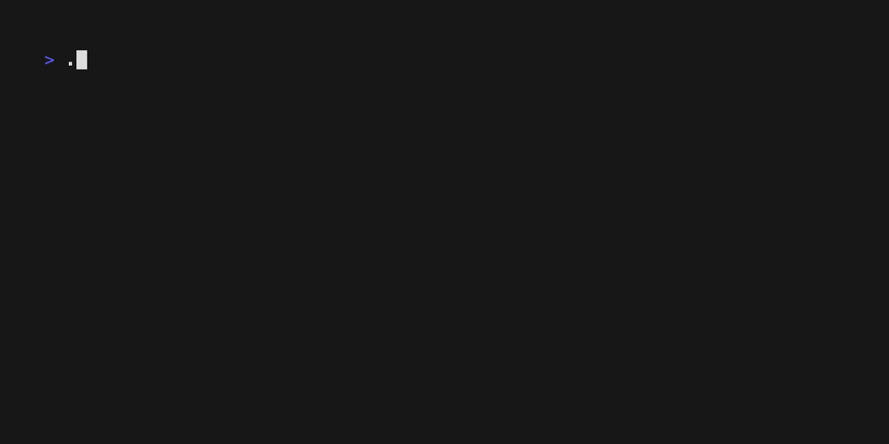

# clair

Purpose:

To play around with [`clair`](https://quay.github.io/clair/) api and see what I can get from it.

## Requirements

1. [gum](https://github.com/charmbracelet/gum?tab=readme-ov-file#installation)
2. [jq](https://jqlang.github.io/jq/download/)
3. curl

Check with `./check.sh`




## Preparation

Copy `.env.example` to `.env`

### Create JWT Token
Use [jwt.io](https://jwt.io/).

Header:
```json
{
  "alg": "HS256",
  "typ": "JWT"
}
```

Payload:
```json
{
  "iss": "quay"
}
```

Verify Signature:
1. Put your clair secret
2. Click the checkbox "secret base64 encoded"

Store the encoded JWT token in `.env`
```sh
JWT_TOKEN=...
```

## Usage

### Get Notification

Example:

```sh
./get_notification.sh f917505f-4690-4706-88cf-0fe356688515
```


### Get Vulnerability Report

Example:

```sh
./get_vulnerability_report.sh fd3b94f4a63a9651ba186b8813bda39503dd1ff558b4a9d3fefaa62f785eb71b
```

## Reference

1. [Api](https://quay.github.io/clair/reference/api.html)